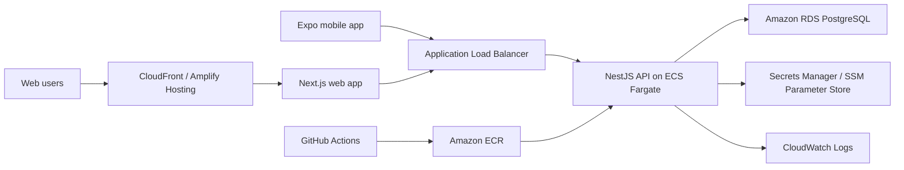
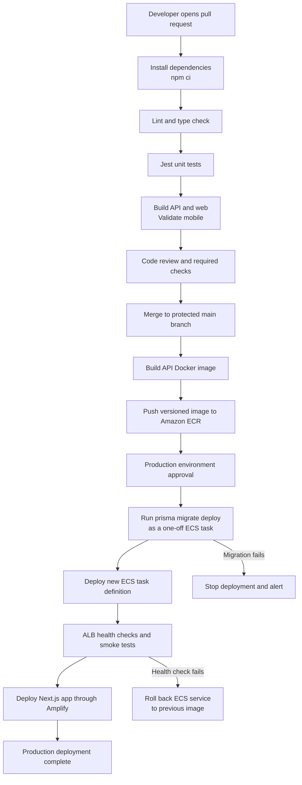

# TeamSync AWS Architecture

This document describes how I would deploy TeamSync on AWS. No real AWS resources are provisioned for this assessment; the goal is to show the intended production architecture and the reasoning behind the choices.

## High-level architecture

## API

I would deploy the NestJS API as a Docker container on ECS Fargate behind an Application Load Balancer.

Why ECS Fargate:

- It fits a predictable long-running REST API.
- It avoids server management while still giving control over CPU, memory, networking, and deployment settings.
- It works well with the Docker-based setup from this assessment.
- It is easier to reason about Prisma connection handling than Lambda for this type of API.
- It supports rolling deployments and health checks through the ECS service and load balancer.

The API would run in private subnets. The Application Load Balancer would be public, terminate HTTPS, and forward traffic to the ECS service.

## Database

PostgreSQL would run on Amazon RDS.

Why RDS:

- Managed backups and point-in-time recovery.
- Monitoring through CloudWatch.
- Easier patching and maintenance than self-managed Postgres.
- Read replicas can be introduced later if read traffic grows.
- It provides a stable relational database for Prisma and the TeamSync data model.

The RDS instance would be placed in private subnets and only allow inbound connections from the API security group. It would not be publicly accessible.

## Web app

The Next.js web app could be deployed on Amplify Hosting or ECS depending on the final rendering needs.

For this assessment, Amplify Hosting is suitable because:

- It supports Git-based deployments.
- It supports environment variables such as `NEXT_PUBLIC_API_URL`.
- It keeps frontend deployment simple.
- It can handle a typical Next.js deployment without introducing extra infrastructure.

Alternative:

- If the app were exported as fully static, S3 + CloudFront would be a simple and cost-effective option.
- If the app required more backend-style runtime control, it could be containerized and deployed to ECS as well.

## Mobile app

The Expo React Native app would be built and distributed using Expo Application Services.

Deployment flow:

- Use EAS Build to create iOS and Android builds.
- Distribute through the Apple App Store and Google Play Store.
- Configure the app with the production API URL through Expo environment variables.

The mobile app would continue using secure native storage for JWTs through `expo-secure-store`.

## Secrets and environment variables

Secrets should not be committed to GitHub or printed in logs.

I would use AWS Secrets Manager or SSM Parameter Store for:

- `DATABASE_URL`
- `JWT_ACCESS_SECRET`
- `JWT_REFRESH_SECRET`
- third-party service keys, if added later

The ECS task definition would reference these secrets so they are injected into the container at runtime. CI/CD environments would also read from GitHub Actions secrets or AWS-managed secrets rather than storing sensitive values in the repository.

## CI/CD

GitHub Actions would be used for automated checks and deployment.

### Pipeline sketch

The production environment in GitHub would require approval before migrations and deployment. This gives the team a final checkpoint while keeping the earlier validation stages automatic.

Pull request workflow:

1. Install dependencies with npm.
2. Run formatting/linting if configured.
3. Run TypeScript type checks.
4. Run Jest unit tests.
5. Build the API.
6. Build the web app.
7. Optionally run an Expo/mobile type check or build validation.

Main branch deployment workflow:

1. Build the API Docker image.
2. Push the image to Amazon ECR.
3. Run database migrations carefully.
4. Deploy the ECS service.
5. Deploy the web app through Amplify Hosting.

For migrations, I would avoid running them casually inside every API container startup. A safer approach is to run Prisma migrations as a separate CI/CD step or one-off ECS task before deploying the new API version.

Each API image would be tagged with the Git commit SHA rather than only `latest`. If the new ECS tasks fail their health checks, the service can return to the previously known working image. A failed migration would stop the pipeline before the API deployment and notify the team for investigation.

The `main` branch would be protected so it can only be updated after the pull request checks pass and a review is approved. AWS access from GitHub Actions should use OpenID Connect with a short-lived, least-privilege IAM role instead of storing long-lived AWS access keys in GitHub.

## Scaling concerns

The main scaling concern is the task list because the `Task` table can grow quickly and is filtered frequently.

Current database strategy:

- Composite index on `projectId`, `status`, `assigneeId`, and `dueDate`.
- Additional index on `projectId` and `dueDate`.
- Additional index on `assigneeId`, `status`, and `dueDate` for the mobile “my tasks” query.
- Pagination to avoid unbounded task list responses.

Future scaling options:

- Add RDS read replicas if task reads become heavy.
- Cache project/task summary counts where exact real-time data is not required.
- Add cursor-based pagination if offset pagination becomes expensive at high page numbers.
- Add more focused indexes based on real query metrics from production.
- Use CloudWatch metrics and slow-query logs to identify bottlenecks.

## Security considerations

- Use HTTPS through the Application Load Balancer and CloudFront/Amplify.
- Keep the database in private subnets.
- Restrict RDS access to the ECS task security group.
- Store secrets in Secrets Manager or SSM Parameter Store.
- Use least-privilege IAM roles for ECS tasks and CI/CD.
- Keep web JWTs in HttpOnly cookies and mobile JWTs in secure native storage.
- Avoid logging tokens, passwords, or raw secrets.

## Observability

At minimum, I would configure:

- CloudWatch Logs for API container logs.
- ECS service health checks.
- RDS CPU, memory, connection, and storage alarms.
- ALB request count, latency, and 5xx alarms.

With more time, I would add structured logging with request IDs so a single request can be traced through the API logs.

## Tradeoffs

I would avoid Lambda for the main API in the first production version. Lambda can work well for event-driven workloads, but for this assessment’s REST API, ECS Fargate is simpler to reason about with Prisma, database connections, long-running service behavior, and Docker-based deployment.

I would also avoid overbuilding infrastructure at the beginning. The first production-ready version should be simple, observable, secure, and easy to deploy. More advanced pieces such as caching, read replicas, and queue-based background jobs should be added when usage or metrics justify them.
