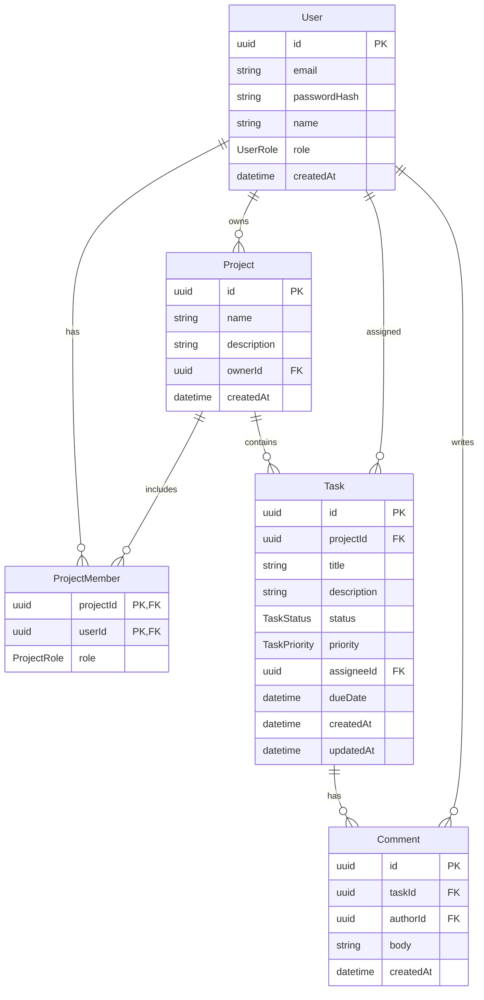

# TeamSync

TeamSync is a full-stack technical assessment project: a lightweight project and task tracking platform built with NestJS, Prisma/PostgreSQL, Next.js, and Expo.

The repository is organized as an npm workspaces monorepo:

- `apps/api` — NestJS REST API
- `apps/web` — Next.js App Router web app
- `apps/mobile` — Expo mobile app
- `docker-compose.yml` — local PostgreSQL database

## Prerequisites

- Node.js 20+
- npm
- Docker Desktop
- Expo Go or an iOS/Android simulator, if running the mobile app

## Local setup

Install dependencies from the repository root:

```bash
npm install
```

Create environment files:

```bash
cp apps/api/.env.example apps/api/.env
cp apps/web/.env.example apps/web/.env.local
cp apps/mobile/.env.example apps/mobile/.env
```

Default local ports:

- API: `http://localhost:3001`
- Web: `http://localhost:3000`
- Postgres: `localhost:5432`
- Prisma Studio: `http://localhost:5555`

For Expo Go on a physical device, replace `EXPO_PUBLIC_API_URL` in `apps/mobile/.env` with your computer's LAN URL, for example `http://192.168.1.20:3001`. A physical phone cannot reach your computer through `localhost`.

Start Postgres:

```bash
npm run db:up
```

Generate Prisma Client, apply migrations, and seed demo data:

```bash
npm run prisma:generate --workspace=@teamsync/api
npm run prisma:deploy --workspace=@teamsync/api
npm run prisma:seed --workspace=@teamsync/api
```

Run the apps in separate terminals:

```bash
npm run dev:api
npm run dev:web
npm run dev:mobile
```

Verify the API:

```bash
curl http://localhost:3001/health
```

Open the web app:

```txt
http://localhost:3000
```

## Demo accounts

The seed script creates:

| Role    | Email                  | Password       |
| ------- | ---------------------- | -------------- |
| Manager | `manager@teamsync.dev` | `Password123!` |
| Member  | `member@teamsync.dev`  | `Password123!` |

The manager and member are both part of the seeded project. The manager can create projects and manage tasks; the member can access only projects they belong to.

## Useful commands

```bash
npm run build
npm run typecheck
npm run db:studio
npm run db:down
```

Use Prisma Studio to inspect the local database:

```bash
npm run db:studio
```

## Implemented API endpoints

Auth:

- `POST /auth/register`
- `POST /auth/login`
- `POST /auth/refresh`
- `POST /auth/logout`
- `GET /auth/me`

Projects:

- `GET /projects`
- `POST /projects`

Tasks:

- `GET /projects/:projectId/tasks`
- `POST /projects/:projectId/tasks`
- `GET /tasks/me`
- `GET /tasks/:taskId`
- `PATCH /tasks/:taskId`
- `POST /tasks/:taskId/comments`

## Key decisions and why

### JWT storage: HttpOnly cookies on web, SecureStore on mobile

The assessment asks for a sensible JWT storage strategy. I chose HttpOnly cookies instead of `localStorage` because access and refresh tokens should not be readable by browser JavaScript. This reduces the impact of XSS: even if malicious script runs in the page, it cannot directly read the JWT values.

For the web app, the API issues:

- a short-lived access-token cookie
- a longer-lived refresh-token cookie

The browser sends those cookies automatically with `credentials: "include"`. When the API returns `401` because the access token is expired, the web client calls `POST /auth/refresh`, receives fresh cookies, and retries the original request once.

The “remember me” checkbox controls refresh-cookie persistence:

- unchecked: refresh cookie is a browser-session cookie
- checked: refresh cookie receives `Max-Age` and survives browser restarts until expiry

The mobile app cannot rely on browser-only HttpOnly cookies in the same way because Expo is a native client, not a browser page. For mobile, the same auth endpoints support an explicit `returnTokens: true` option. When mobile logs in, the backend returns the access token and refresh token in the JSON response. The app stores those tokens with `expo-secure-store`, then sends the access token on API calls using the standard `Authorization: Bearer <token>` header.

This keeps the security decision appropriate for each client:

- web: tokens are hidden from JavaScript in HttpOnly cookies
- mobile: tokens are stored in native secure storage through `expo-secure-store`
- AsyncStorage is not used for auth tokens

### Short-lived access token + longer-lived refresh token

Access tokens are intentionally short-lived so a stolen access token has a small usefulness window. Refresh tokens last longer because they are used to continue the session without forcing the user to log in repeatedly. On the web, the refresh token is stored as an HttpOnly cookie and is verified by the backend before new cookies are issued.

On mobile, the same refresh-token idea is used, but the transport is different. If an API request returns `401`, the mobile API client calls `POST /auth/refresh` with the stored refresh token and `returnTokens: true`. If refresh succeeds, the new tokens replace the old ones in SecureStore and the failed request is retried once. If refresh fails, the stored tokens are cleared and the user is sent back to login.

### React Query for server state

The web app uses React Query because projects, tasks, task detail, comments, and the current user are server state. React Query gives the app consistent loading, error, empty, and refetch behavior without building custom state management.

On login, register, and logout, cached queries are removed with `queryClient.removeQueries()`. This prevents data from one user, such as a manager’s project list, from flashing for another user after switching accounts in the same browser session.

### Mobile token and offline cache storage

The Expo app stores access and refresh tokens with `expo-secure-store`, not AsyncStorage. SecureStore maps to the platform secure storage mechanism, which is more appropriate for auth tokens than plain key-value storage.

AsyncStorage is used only for cached task data. The mobile task list stores the last successful `GET /tasks/me` response locally. If a later API fetch fails, the app falls back to that cached task list and displays a visible “Showing cached data” indicator so the user knows they are not seeing fresh API data.

The mobile app also requests Expo notification permission after login and stores the Expo push token in SecureStore. The token is logged locally for the assessment; no real push-delivery backend is implemented.

The mobile app uses Expo Router so login, dashboard, and task detail are separate route-based screens.

### NestJS guards and role-based access control

Authentication and role checks are handled with NestJS guards instead of scattered controller-level conditionals. `JwtAuthGuard` protects authenticated routes, while the custom `@Roles()` decorator and `RolesGuard` handle global role checks such as restricting `POST /projects` to `ADMIN` and `MANAGER`.

Task-specific authorization lives in the task service because it depends on business rules: a task can be updated by the task assignee, the project manager, or an admin.

### Prisma schema with explicit join table

Projects use a `ProjectMember` join table instead of a simple many-to-many relation. This is intentional because membership has extra data: the user’s per-project role (`MANAGER` or `MEMBER`). A user can be a global `MEMBER` but still have different membership relationships across projects.

### DTO validation

The API uses DTOs with `class-validator` and a global `ValidationPipe`. This keeps invalid payload handling close to the route contract and prevents unknown fields from silently flowing into business logic.

### Design tokens in the web app

The web app follows the assessment’s design tokens directly:

- primary `#2563EB`
- primary-dark `#1E40AF`
- success `#16A34A`
- warning `#D97706`
- danger `#DC2626`
- neutral grayscale
- H1 `28px/700`
- H2 `22px/600`
- body `15px/400`
- caption `13px/400`
- cards `8px` radius
- buttons and inputs `6px` radius
- mobile/tablet/desktop breakpoints at `375px`, `768px`, and `1280px`

## ERD



## Indexing note

The task list is the highest-risk query as the dataset grows because it is filtered by project and often narrowed by status and assignee, then sorted by due date. For 1M+ tasks, the main index is a composite index on `projectId`, `status`, `assigneeId`, and `dueDate`. This lets Postgres quickly find tasks for one project, apply equality filters for status and assignee, and read results in due-date order without scanning the full table. The left-to-right order matters: `projectId` comes first because almost every task-list query is scoped to one project; `status` and `assigneeId` are common equality filters; `dueDate` comes last because it supports sorting after filtering.

I also added `@@index([projectId, dueDate])` for project task lists where status or assignee filters are not supplied, and `@@index([assigneeId, status, dueDate])` for a “my tasks” style mobile query. These secondary indexes avoid forcing every query shape through one over-specific composite index. The tradeoff is extra write overhead and storage, but tasks are read and filtered much more frequently than they are bulk-written in this product.

Prisma annotations:

```prisma
model Task {
  // ...
  @@index([projectId, status, assigneeId, dueDate])
  @@index([projectId, dueDate])
  @@index([assigneeId, status, dueDate])
}
```

## Reviewer notes

- No real secrets are committed. Use `.env.example` files as templates.
- The local setup uses free local infrastructure only.
- `npm run db:up` starts Postgres for local development through Docker Compose. The API and web app are run with npm scripts so NestJS and Next.js hot reload work during assessment review.
- If Prisma Studio shows stale-client errors, stop the old Studio process and restart it with `npm run db:studio`.
